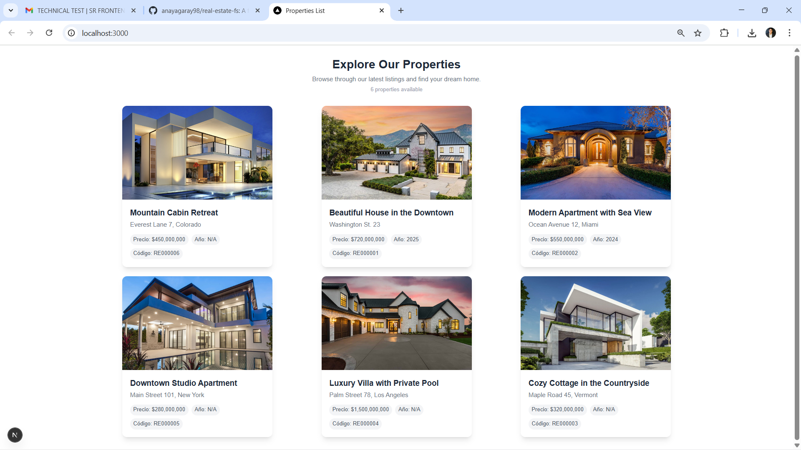
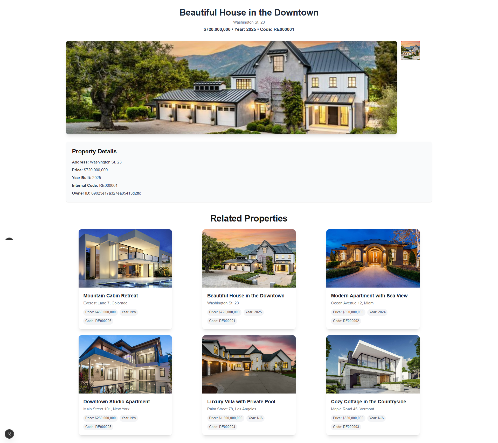

# Real Estate Platform

This project is a **full-stack real estate platform** built with **Next.js**, **MongoDB**, and **.NET 8**. It allows users to manage properties, owners, property images, and property traces, providing full **CRUD functionality** for all entities.


## 🏗️ Infrastructure

- **Frontend**: Next.js (React) with Tailwind CSS for a modern, responsive UI.  
- **Backend**: .NET 8 Web API for business logic, endpoints, and data management.  
- **Database**: MongoDB for flexible document storage.   


## Backend Postman Collection
https://www.postman.com/warped-zodiac-706868/workspace/million-api/collection/20517327-38466f6e-3012-448e-b467-ab67df6df1e5?action=share&source=copy-link&creator=20517327

## 📋 Features

- Full **CRUD operations** for:
  - **Properties**
  - **Owners**
  - **Property Images**
  - **Property Traces**
- List, search, and filter properties.
- Bulk deletion of properties.
- Responsive UI with loading and error states.
- API structured with REST endpoints.


## 🗂️ Database / Collections

| Collection | Description |
|------------|-------------|
| `Properties` | Stores all properties with fields: `Name`, `Address`, `Price`, `CodeInternal`, `Year`, `IdOwner`. |
| `Owners` | Stores property owners with fields: `Name`, `Address`, `Photo`, `Birthday`. |
| `PropertyImages` | Stores property images linked to a property (`IdProperty`), with `File` and `Enabled` status. |
| `PropertyTraces` | Tracks property sales or value changes with `DateSale`, `Name`, `Value`, `Tax`, linked to a property (`IdProperty`). |


## 🖼️ Screenshots

**Property List Page**



**Property Details Page**




## 🔧 Backend API Documentation

### Properties

| Method | Endpoint | Description |
|--------|----------|-------------|
| GET | `/api/properties` | Get all properties, optional query filters: `name`, `address`, `minPrice`, `maxPrice`. |
| GET | `/api/properties/{id}` | Get a property by ID, including images and traces. |
| POST | `/api/properties` | Create a new property with optional images. |
| DELETE | `/api/properties/bulk` | Bulk delete properties by IDs. |

### Owners

| Method | Endpoint | Description |
|--------|----------|-------------|
| GET | `/api/owners` | Get all owners. |
| GET | `/api/owners/{id}` | Get owner by ID. |
| POST | `/api/owners` | Create a new owner. |
| PUT | `/api/owners/{id}` | Update an owner by ID. |
| DELETE | `/api/owners/{id}` | Delete an owner by ID. |

### Property Images & Traces

- Handled through **Property endpoints**, returned as nested DTOs (`Images`, `Traces`).  
- Images: `IdPropertyImage`, `File`, `Enabled`.  
- Traces: `IdPropertyTrace`, `DateSale`, `Name`, `Value`, `Tax`.


## 🚀 How to Run All Together
It will run the MongoDB, backend and frontend together.

### Docker Compose
```bash
docker-compose up -d
```


## 🚀 How to Run Separately

### Backend (.NET 8)
```bash
cd backend
dotnet run
```

### Frontend (Next.js)
```bash
cd frontend
npm run dev
```

## Swagger
```json
{
    "openapi": "3.0.4",
    "info": {
        "title": "Real Estate API",
        "description": "API for managing property data from MongoDB",
        "version": "v1"
    },
    "paths": {
        "/api/Owners": {
            "get": {
                "tags": [
                    "Owners"
                ],
                "responses": {
                    "200": {
                        "description": "OK",
                        "content": {
                            "text/plain": {
                                "schema": {
                                    "type": "array",
                                    "items": {
                                        "$ref": "#/components/schemas/OwnerDto"
                                    }
                                }
                            },
                            "application/json": {
                                "schema": {
                                    "type": "array",
                                    "items": {
                                        "$ref": "#/components/schemas/OwnerDto"
                                    }
                                }
                            },
                            "text/json": {
                                "schema": {
                                    "type": "array",
                                    "items": {
                                        "$ref": "#/components/schemas/OwnerDto"
                                    }
                                }
                            }
                        }
                    }
                }
            },
            "post": {
                "tags": [
                    "Owners"
                ],
                "requestBody": {
                    "content": {
                        "application/json": {
                            "schema": {
                                "$ref": "#/components/schemas/OwnerDto"
                            }
                        },
                        "text/json": {
                            "schema": {
                                "$ref": "#/components/schemas/OwnerDto"
                            }
                        },
                        "application/*+json": {
                            "schema": {
                                "$ref": "#/components/schemas/OwnerDto"
                            }
                        }
                    }
                },
                "responses": {
                    "200": {
                        "description": "OK",
                        "content": {
                            "text/plain": {
                                "schema": {
                                    "$ref": "#/components/schemas/OwnerDto"
                                }
                            },
                            "application/json": {
                                "schema": {
                                    "$ref": "#/components/schemas/OwnerDto"
                                }
                            },
                            "text/json": {
                                "schema": {
                                    "$ref": "#/components/schemas/OwnerDto"
                                }
                            }
                        }
                    }
                }
            }
        },
        "/api/Owners/{id}": {
            "get": {
                "tags": [
                    "Owners"
                ],
                "parameters": [
                    {
                        "name": "id",
                        "in": "path",
                        "required": true,
                        "schema": {
                            "type": "string"
                        }
                    }
                ],
                "responses": {
                    "200": {
                        "description": "OK",
                        "content": {
                            "text/plain": {
                                "schema": {
                                    "$ref": "#/components/schemas/OwnerDto"
                                }
                            },
                            "application/json": {
                                "schema": {
                                    "$ref": "#/components/schemas/OwnerDto"
                                }
                            },
                            "text/json": {
                                "schema": {
                                    "$ref": "#/components/schemas/OwnerDto"
                                }
                            }
                        }
                    }
                }
            },
            "put": {
                "tags": [
                    "Owners"
                ],
                "parameters": [
                    {
                        "name": "id",
                        "in": "path",
                        "required": true,
                        "schema": {
                            "type": "string"
                        }
                    }
                ],
                "requestBody": {
                    "content": {
                        "application/json": {
                            "schema": {
                                "$ref": "#/components/schemas/OwnerDto"
                            }
                        },
                        "text/json": {
                            "schema": {
                                "$ref": "#/components/schemas/OwnerDto"
                            }
                        },
                        "application/*+json": {
                            "schema": {
                                "$ref": "#/components/schemas/OwnerDto"
                            }
                        }
                    }
                },
                "responses": {
                    "200": {
                        "description": "OK",
                        "content": {
                            "text/plain": {
                                "schema": {
                                    "$ref": "#/components/schemas/OwnerDto"
                                }
                            },
                            "application/json": {
                                "schema": {
                                    "$ref": "#/components/schemas/OwnerDto"
                                }
                            },
                            "text/json": {
                                "schema": {
                                    "$ref": "#/components/schemas/OwnerDto"
                                }
                            }
                        }
                    }
                }
            },
            "delete": {
                "tags": [
                    "Owners"
                ],
                "parameters": [
                    {
                        "name": "id",
                        "in": "path",
                        "required": true,
                        "schema": {
                            "type": "string"
                        }
                    }
                ],
                "responses": {
                    "200": {
                        "description": "OK"
                    }
                }
            }
        },
        "/api/Properties": {
            "get": {
                "tags": [
                    "Properties"
                ],
                "parameters": [
                    {
                        "name": "name",
                        "in": "query",
                        "schema": {
                            "type": "string"
                        }
                    },
                    {
                        "name": "address",
                        "in": "query",
                        "schema": {
                            "type": "string"
                        }
                    },
                    {
                        "name": "minPrice",
                        "in": "query",
                        "schema": {
                            "type": "number",
                            "format": "double"
                        }
                    },
                    {
                        "name": "maxPrice",
                        "in": "query",
                        "schema": {
                            "type": "number",
                            "format": "double"
                        }
                    }
                ],
                "responses": {
                    "200": {
                        "description": "OK",
                        "content": {
                            "text/plain": {
                                "schema": {
                                    "type": "array",
                                    "items": {
                                        "$ref": "#/components/schemas/PropertyListDto"
                                    }
                                }
                            },
                            "application/json": {
                                "schema": {
                                    "type": "array",
                                    "items": {
                                        "$ref": "#/components/schemas/PropertyListDto"
                                    }
                                }
                            },
                            "text/json": {
                                "schema": {
                                    "type": "array",
                                    "items": {
                                        "$ref": "#/components/schemas/PropertyListDto"
                                    }
                                }
                            }
                        }
                    }
                }
            },
            "post": {
                "tags": [
                    "Properties"
                ],
                "requestBody": {
                    "content": {
                        "application/json": {
                            "schema": {
                                "$ref": "#/components/schemas/PropertyCreateDto"
                            }
                        },
                        "text/json": {
                            "schema": {
                                "$ref": "#/components/schemas/PropertyCreateDto"
                            }
                        },
                        "application/*+json": {
                            "schema": {
                                "$ref": "#/components/schemas/PropertyCreateDto"
                            }
                        }
                    }
                },
                "responses": {
                    "200": {
                        "description": "OK",
                        "content": {
                            "text/plain": {
                                "schema": {
                                    "$ref": "#/components/schemas/PropertyDetailDto"
                                }
                            },
                            "application/json": {
                                "schema": {
                                    "$ref": "#/components/schemas/PropertyDetailDto"
                                }
                            },
                            "text/json": {
                                "schema": {
                                    "$ref": "#/components/schemas/PropertyDetailDto"
                                }
                            }
                        }
                    }
                }
            }
        },
        "/api/Properties/{id}": {
            "get": {
                "tags": [
                    "Properties"
                ],
                "parameters": [
                    {
                        "name": "id",
                        "in": "path",
                        "required": true,
                        "schema": {
                            "type": "string"
                        }
                    }
                ],
                "responses": {
                    "200": {
                        "description": "OK",
                        "content": {
                            "text/plain": {
                                "schema": {
                                    "$ref": "#/components/schemas/PropertyDetailDto"
                                }
                            },
                            "application/json": {
                                "schema": {
                                    "$ref": "#/components/schemas/PropertyDetailDto"
                                }
                            },
                            "text/json": {
                                "schema": {
                                    "$ref": "#/components/schemas/PropertyDetailDto"
                                }
                            }
                        }
                    }
                }
            }
        },
        "/api/Properties/bulk": {
            "delete": {
                "tags": [
                    "Properties"
                ],
                "requestBody": {
                    "content": {
                        "application/json": {
                            "schema": {
                                "$ref": "#/components/schemas/PropertyBulkDeleteDto"
                            }
                        },
                        "text/json": {
                            "schema": {
                                "$ref": "#/components/schemas/PropertyBulkDeleteDto"
                            }
                        },
                        "application/*+json": {
                            "schema": {
                                "$ref": "#/components/schemas/PropertyBulkDeleteDto"
                            }
                        }
                    }
                },
                "responses": {
                    "200": {
                        "description": "OK"
                    }
                }
            }
        }
    },
    "components": {
        "schemas": {
            "OwnerDto": {
                "type": "object",
                "properties": {
                    "idOwner": {
                        "type": "string",
                        "nullable": true
                    },
                    "name": {
                        "type": "string",
                        "nullable": true
                    },
                    "address": {
                        "type": "string",
                        "nullable": true
                    },
                    "photo": {
                        "type": "string",
                        "nullable": true
                    },
                    "birthday": {
                        "type": "string",
                        "format": "date-time",
                        "nullable": true
                    }
                },
                "additionalProperties": false
            },
            "PropertyBulkDeleteDto": {
                "type": "object",
                "properties": {
                    "ids": {
                        "type": "array",
                        "items": {
                            "type": "string"
                        },
                        "nullable": true
                    }
                },
                "additionalProperties": false
            },
            "PropertyCreateDto": {
                "type": "object",
                "properties": {
                    "name": {
                        "type": "string",
                        "nullable": true
                    },
                    "address": {
                        "type": "string",
                        "nullable": true
                    },
                    "price": {
                        "type": "number",
                        "format": "double"
                    },
                    "codeInternal": {
                        "type": "string",
                        "nullable": true
                    },
                    "year": {
                        "type": "integer",
                        "format": "int32"
                    },
                    "idOwner": {
                        "type": "string",
                        "nullable": true
                    },
                    "images": {
                        "type": "array",
                        "items": {
                            "type": "string"
                        },
                        "nullable": true
                    }
                },
                "additionalProperties": false
            },
            "PropertyDetailDto": {
                "type": "object",
                "properties": {
                    "idProperty": {
                        "type": "string",
                        "nullable": true
                    },
                    "name": {
                        "type": "string",
                        "nullable": true
                    },
                    "address": {
                        "type": "string",
                        "nullable": true
                    },
                    "price": {
                        "type": "number",
                        "format": "double"
                    },
                    "codeInternal": {
                        "type": "string",
                        "nullable": true
                    },
                    "year": {
                        "type": "integer",
                        "format": "int32"
                    },
                    "idOwner": {
                        "type": "string",
                        "nullable": true
                    },
                    "images": {
                        "type": "array",
                        "items": {
                            "$ref": "#/components/schemas/PropertyImageDto"
                        },
                        "nullable": true
                    },
                    "traces": {
                        "type": "array",
                        "items": {
                            "$ref": "#/components/schemas/PropertyTraceDto"
                        },
                        "nullable": true
                    }
                },
                "additionalProperties": false
            },
            "PropertyImageDto": {
                "type": "object",
                "properties": {
                    "idPropertyImage": {
                        "type": "string",
                        "nullable": true
                    },
                    "file": {
                        "type": "string",
                        "nullable": true
                    },
                    "enabled": {
                        "type": "boolean"
                    }
                },
                "additionalProperties": false
            },
            "PropertyListDto": {
                "type": "object",
                "properties": {
                    "idProperty": {
                        "type": "string",
                        "nullable": true
                    },
                    "name": {
                        "type": "string",
                        "nullable": true
                    },
                    "address": {
                        "type": "string",
                        "nullable": true
                    },
                    "price": {
                        "type": "number",
                        "format": "double"
                    },
                    "year": {
                        "type": "integer",
                        "format": "int32"
                    },
                    "codeInternal": {
                        "type": "string",
                        "nullable": true
                    },
                    "idOwner": {
                        "type": "string",
                        "nullable": true
                    },
                    "image": {
                        "type": "string",
                        "nullable": true
                    }
                },
                "additionalProperties": false
            },
            "PropertyTraceDto": {
                "type": "object",
                "properties": {
                    "idPropertyTrace": {
                        "type": "string",
                        "nullable": true
                    },
                    "dateSale": {
                        "type": "string",
                        "format": "date-time"
                    },
                    "name": {
                        "type": "string",
                        "nullable": true
                    },
                    "value": {
                        "type": "number",
                        "format": "double"
                    },
                    "tax": {
                        "type": "number",
                        "format": "double"
                    }
                },
                "additionalProperties": false
            }
        }
    }
}
```

